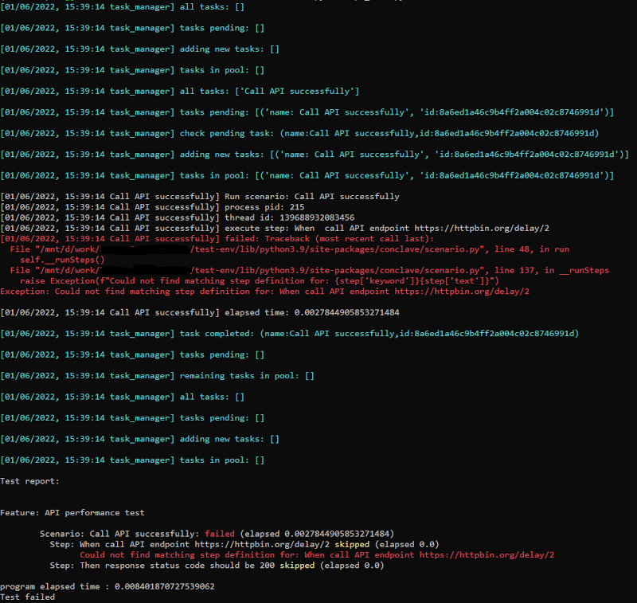
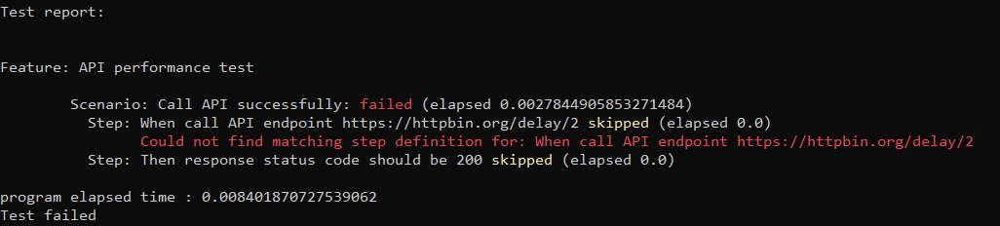
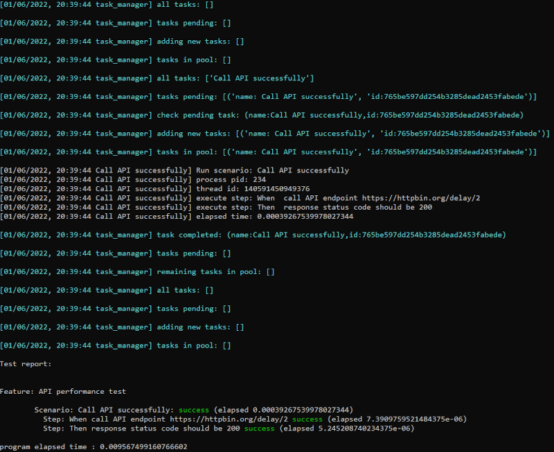

# Paraworld

**Paraworld** is a BDD framework using the Gherkin language for writing automated tests. The framework is written in Python 3.9.
It is created to allow the ease of writing concurrent and parallel scenarios.

The framework supports the following distinct features:

- Run scenarios [concurrently](docs/concurrent-scenarios.md)
- Run scenarios in [parallel](docs/parallel-scenarios.md)
- Run steps [concurrently](docs/concurrent-steps.md)
- [Apply ordering and dependency for scenarios](docs/dependency_management.md)
- [Timeline visualization](docs/timeline.md)
- [Dependency visualization](docs/dependency.md)
- [Report visualization](docs/report.md)

# Documentation

- [Install](#install)
- [Getting started](#getting-started)
    - [Create feature](#create-feature)
    - [Run feature](#run-feature)
    - [Create step definition](#step-definition)
    - [Include step definition module and run feature file](#include-step-definition-module-and-run-feature-file)
    - [Implement functionality for step definition](#implement-functionality-for-step-definition)
- [Reference](#reference)
- [Examples](#examples)
- [Development](#development)


# Install

To use the framework install it through pip:

```shell
pip install paraworld
```

# Getting started

Once you have installed **paraworld** you are ready to start writing your first BDD feature.
In order to get you started we will start by writing a simple feature with scenarios and implement the
functionalities.

## Create feature

Let's start by creating a feature to test out the performance of calling a specific API. Lets create a new file and call it *api.feature*.
Paste the below text into the *api.feature* file:

```feature
# api.feature

Feature: API performance test

    This feature will test the performance of calling an API

    Scenario: Call API successfully
        When call API endpoint https://httpbin.org/delay/2
        Then response status code should be 200
```

So the above feature file have a single scenario which is testing that calling the specified API endpoint will return a status code 200.

So now that we have written the feature in gherkin language, we are ready to run the feature file using **paraworld**.

## Run feature

Create a new python file called *api_test.py* and paste the below code into it:

```python
# api_test.py
1   import os
2   from conclave.task_runner import TaskRunner
3  
4   if __name__ == '__main__':
5       tr = TaskRunner(debugMode=True)
6       testResult = tr.run(["api.feature"])
7
8       print("\nprogram elapsed time :", testResult.elapsed)
9    
10      if not testResult.success:
11          print(f"Test failed")
12          os._exit(1)
```

Lets go through the above code. We are importing a few modules from line 1-2 and the important thing to notice above is the modules starting with **conclave** are the actual modules from **paraworld**.

Next we implements the *main* method in line 10 for this file and in the main method we instantiates an instance of class [TaskRunner](docs/reference.md#class-taskrunner) in line 10. To start the execution of the feature file we will need to call the [run method](docs/reference.md#runfeaturefiles) of the taskrunner instance passing in the name and path of the feature file we wish to execute. As you can see we can pass in multiple feature files to be executed, but in our case we only have a single feature we wish to execute.

Once the execution of the feature file has been completed we will get back a [TestResultInfo](docs/reference.md#testresultinfo) object which stores information with regards to the execution of the feature file.
In line 13 we are printing out the time it elapsed time of the entire execution. Then in line 15 we check if the execution has completed successfully and if it has not then we will exit the application with exit code 1.

Lets execute the above python file:

```shell
python api_test.py
```

You will see output similar to something like the below:



Lets examine the console output above. The text lines in cyan color are debug level messages. If we don't want to see the debug messages we should set the [debugMode parameter](docs/reference.md#class-taskrunner) to false. In our case it has been set to True in line 11 in the api_test.py code.

Following the debug messages we then have lines printed out in white color like the following:

```shell
[01/06/2022, 15:39:14 Call API successfully] Run scenario: Call API successfully
[01/06/2022, 15:39:14 Call API successfully] process pid: 215
[01/06/2022, 15:39:14 Call API successfully] thread id: 139688932083456
[01/06/2022, 15:39:14 Call API successfully] execute step: When  call API endpoint https://httpbin.org/delay/2
```

In the above we have information with regards to the scenario that is being executed, which is the scenario with the title *Call API successfully*. We can see that the scenario is being executed inside the process with PID *215* and on the thread with id *139688932083456*. Then it starts executing the step named *When call API endpoint https://httpbin.org/delay/2*.

But what happens next is we get an error:

```shell
[01/06/2022, 15:39:14 Call API successfully] failed: Traceback (most recent call last):
  File "/mnt/d/work/test-env/lib/python3.9/site-packages/conclave/scenario.py", line 48, in run
    self.__runSteps()
  File "/mnt/d/work/test-env/lib/python3.9/site-packages/conclave/scenario.py", line 137, in __runSteps
    raise Exception(f"Could not find matching step definition for: {step['keyword']}{step['text']}")
Exception: Could not find matching step definition for: When call API endpoint https://httpbin.org/delay/2
```

The above error says *Could not find matching step definition for: When call API endpoint https://httpbin.org/delay/2*.
What this means is the **TaskRunner** could not find any implementation for the specified step. We need to implement a step definition which is the code to be executed when the TaskRunner executes the above step.

Lets move on to the few last lines of the console output:



So the above snippet shows the summary of the execution being printed out. We will get a summary of all the features that have been executed with information about the status of each scenario and steps as well as their elapsed time. We can see that we have failed to execute the scenario called *Call API successfully* due to the missing step definition for step *When call API endpoint https://httpbin.org/delay/2*. But what is interesting is our second step *Then response status code should be 200* has status of *skipped*.

What does the status *skipped* mean? Well if the TaskRunner fails to execute the previous step for whatever reason then there is no point in executing all the subsequent steps and that is why the step has been marked as *skipped*. Notice that we have not implemented step definitions for both steps, so even our second step will also complain with missing step definition if we only implement the first step.

So we can see that our test failed due to missing step definitions. Let's go ahead and implement the step definition for the missing steps.

## Step definition

A step definition is a function that matches a given step and will be executed by the TaskRunner. The TaskRunner will look through all step definitions to find the one that matches the text of the step and in turn execute that function.

In the following we will create a new python file to store our step definitions. Create a new folder named *steps* and in there create a new python file named *api_steps.py* and paste the below code:

```python
# steps/api_steps.py
1   from typing import Match
2   from conclave.step import Step
3   from conclave.task_logger import TaskLogger
4 
5   @Step(pattern="^call API endpoint (.+)$")
6   def callAPIendpointStep(logger: TaskLogger, world: World, match: Match[str]):
7       pass
8
9   @Step(pattern="^response status code should be (.+)$")
10  def validateStatusCodeStep(logger: TaskLogger, world: World, match: Match[str]):
11      pass
```

Let's go through the code and explain how we have defined the step definitions. In line 2-3 we have imported the **paraworld** modules needed to define step definitions. We have created to functions called *callAPIendpointStep* and *validateStatusCodeStep* in line 6 and 10. These functions will do nothin as of now.

In order to mark a function as a step definition we will be using a python decorator class [Step](docs/reference.md#class-step). Line 5 and 9 we have added the **@Step** decorator to mark our two functions as step definitions. The **Step** decorator also takes a single parameter named *pattern* where the value is a regular expression that will be used by the TaskRunner to match against the text steps.

As you can see the two functions both have the same number of arguments:

- **logger** - an instance of class [TaskLogger](docs/reference.md#class-tasklogger). This object can be used to log information and will be shown in the console.
- **world** - an instance of class [World](docs/reference.md#class-world). The **World** class is an immutable key/value store that can be shared across features, scenarios and steps. It encompasses all shared variables across the entire application. We will show its usage later on.
- **match** - an instance of class [Match](https://docs.python.org/3/library/re.html#match-objects). This object holds the result of the matched regular expression and can for example be used to extract capturing groups from the regular expression. We will show its usage later on.

So now that we have implemented the step definition let's make sure our test knows about the definition and re-run the feature file.

## Include step definition module and run feature file

Lets open our *api_test.py* file and modify the code to import our module *api_steps.py*

```python
# api_test.py

1   import os
2   from conclave.task_runner import TaskRunner
3   from steps import api_steps
4  
5   if __name__ == '__main__':
6       tr = TaskRunner(debugMode=True)
7       testResult = tr.run(["api.feature"])
8
9       print("\nprogram elapsed time :", testResult.elapsed)
10    
11      if not testResult.success:
12          print(f"Test failed")
13          os._exit(1)
```

Then let's run the test again by executing:

```shell
python api_test.py
```

The console output should now look like:



We can see from the output that the TaskRunner can now find and match out two steps and they have been executed successfully.

## Implement functionality for step definition

The code for the step definitions are not that interesting since they do nothing, so let's go ahead and implement some real functionality for the two step definitions. Open the *steps/api_steps.py* file and modify it to look like the below:

```python
# steps/api_steps.py
1   from typing import Match
2   from conclave.step import Step
3   from conclave.world import World
4   from conclave.task_logger import TaskLogger
5   import requests

6   @Step(pattern="^call API endpoint (.+)$")
7   def callAPIendpointStep(logger: TaskLogger, world: World, match: Match[str]):
8       url = match.group(1)
9       logger.log(f"Call API: {url}")
10      resp = requests.get(url)
11      logger.log(f"response: {resp}")
12      world.setProp("ApiStatusCode", resp.status_code)

13  @Step(pattern="^response status code should be (.+)$")
14  def validateStatusCodeStep(logger: TaskLogger, world: World, match: Match[str]):
15      expectedStatusCode = match.group(1)
16      statusCode = world.getProp("ApiStatusCode")
17      if int(expectedStatusCode) != statusCode:
18          raise Exception(f"Expected status code {expectedStatusCode} but got {statusCode}")
19      logger.log(f"expected status code: {statusCode} SUCCESS")
```

Let's go through the code above and explain it. Line 7 we are extracting the url from the regular expression capturing group at index 1. This will give us whatever url the step text has supplied. Line 9 we have used the logger object to print the url to the console. Line 10 is the actual call to the url using HTTP GET. Line 11 we print out the response from the HTTP GET request. And line 12 we are using the world object to store the value of the status code under the key *ApiStatusCode*

Moving on to the next step definition we have line 15 which will be extracting the expected status code value from the regular expression capturing group at index 1. Line 6 we use the world object to retrieve the real status code value we have stored from the step definition in line 12. Line 17 we compare if the real status code matches the expected status code and if not we will raise an exception. Line 19 we print out that it all matches successfully.

Let us run the test again and see what we get now:

```shell
python api_test.py
```
The output should show something like the below:


We can see from the output that all steps have been executed successfully and the expected status code is 200 after calling the API endpoint.

# Reference

[Here](docs/reference.md) is a complete reference of all the classes and methods available in **paraworld**.

# Examples

Here is a list of different examples that showcases the different features of **paraworld**:

- [Concurrent scenarios](docs/examples/concurrent-scenarios.md)
- [Parallel scenarios](docs/examples/parallel-scenarios.md)
- [Scenario dependency](docs/examples/scenario-dependency.md)
- [Groups](docs/examples/groups.md)
- [Concurrent steps](docs/examples/concurrent-steps.md)

# How to build

To test the build locally create a virtual environment:

```shell
python -m venv paraworld-env
paraworld-env\Scripts\activate.bat
```

If not already installed then install the build package:

```shell
python -m pip install --upgrade build
```

Build the report first by doing the following:

*Window*:

```shell
cd report
npm run build_window
cd ..
```

Then run the build command

```shell
python -m build
```

The will create a gz and whl file inside a **dist** folder

# Test locally

To test the build locally create a virtual environment:

*Windows*:

```shell
python -m venv test-env
test-env\Scripts\activate.bat
```

Then run pip install the **whl** file that is created by the build command:

```shell
pip install <path to paraworld whl file>
```

So if the whl file is in dist and called **paraworld-0.0.1-py3-none-any.whl** then run:

```shell
pip install dist/paraworld-0.0.1-py3-none-any.whl
```

Now lets test the installed package, by running the test file **test_local_build.py**:

```shell
cd test
python test_local_build.py
```

# Publish to TestPyPI

Before publishing to PyPI you can upload to TestPyPI for testing the package:

```shell
twine upload --repository testpypi dist/*
``` 

This will upload whatever is in the **dist** folder to TestPyPI.

To test out the newly published package:

```shell
python -m pip install --index-url https://test.pypi.org/simple/ --extra-index-url https://pypi.org/simple/ paraworld
```