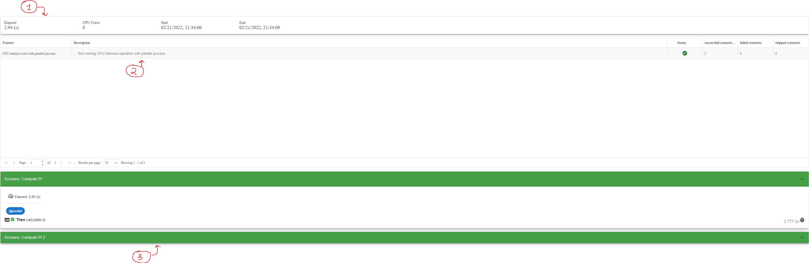

# Report visualization

This is the documentation for **Version 1.1.0**

**paraworld** can produce a custom HTML report of the execution that will display all the features, scenarios and steps being executed.

To generate the timeline graph you will need to call the method [generateReport()](api.md#generatereport) of the [TaskRunner](api.md#class-taskrunner) object.

Example:

```python
tr = TaskRunner(debugMode=True)
tr.run(["test.feature"])

tr.generateReport()
```

The output will be an HTML file named *report_output.html* which will look something like this:



Lets break down the main parts of the UI above:

1) this box displays general information about the entire execution such as:

    - Elapsed - the time in seconds it took to execute the entire application
    - CPU core - how many CPU cores were present during the execution
    - Start - the start date time
    - End - the end date time

2) This UI shows a table containing all the features that are part of the execution. A green check mark next to the feature indicates that the feature has been successfully completed. And you can see a count of how many successfull scenarios, failed scenarios or skipped scenarios.

3) You can click on a feature file in the table and a detailed list of scenarios will appear in this part of the UI. Each scenario can starts out collapsed and you can expand the scenario by clicking on the title or green bar.

    detailed information about the scenario will be shown as well as each step in that scenario together with the logs for each step. To see the logs for each step click on the grey console icon next to each step.