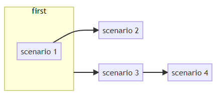

# Dependency graph

*`This is the documentation for Version 1.3.0`*

**paraworld** can visualize a dependency graph of all the scenarios in all features. This is useful in understanding which scenario depends on which as well as grouping of scenarios and their dependencies.

To generate the timeline graph you will need to call the method [generateDependencyGraph()](api.md#generatedependencygraph) of the [TaskRunner](api.md#class-taskrunner) object.

Example:

```python
tr = TaskRunner(debugMode=True)
tr.run(["test.feature"])

tr.generateDependencyGraph()
```

The output will be an HTML file named *dependency_output.html* which will look something like this:


