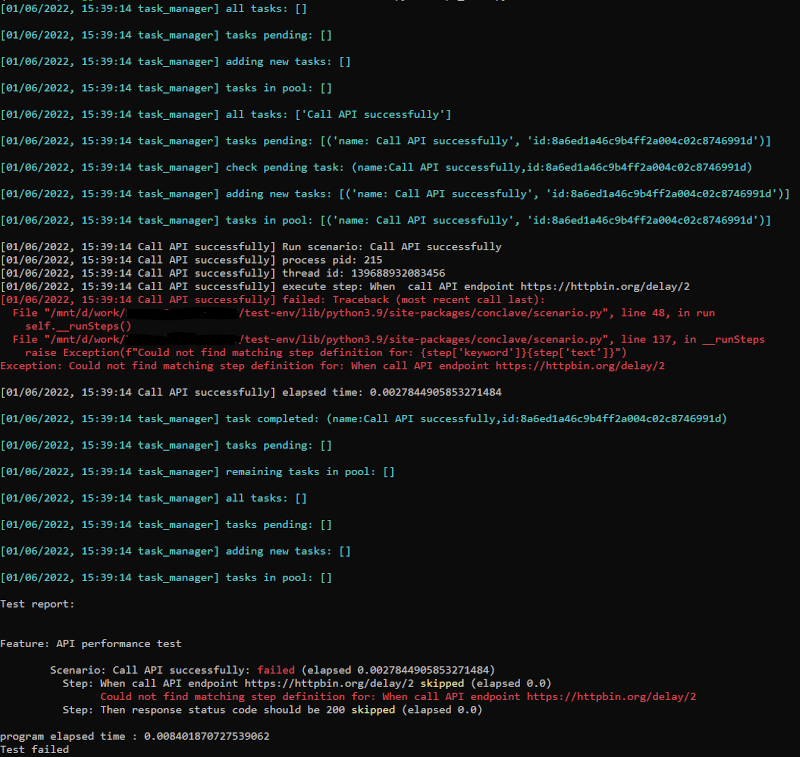
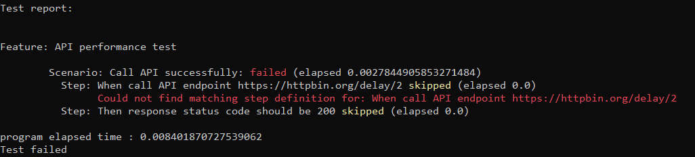
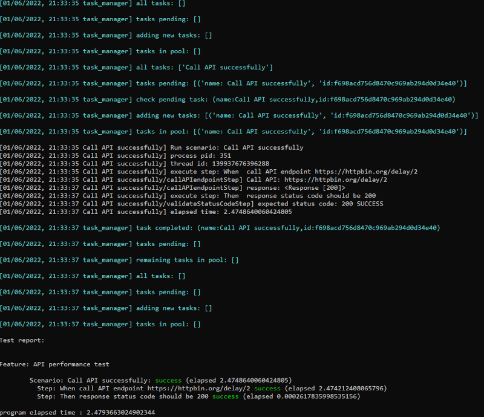
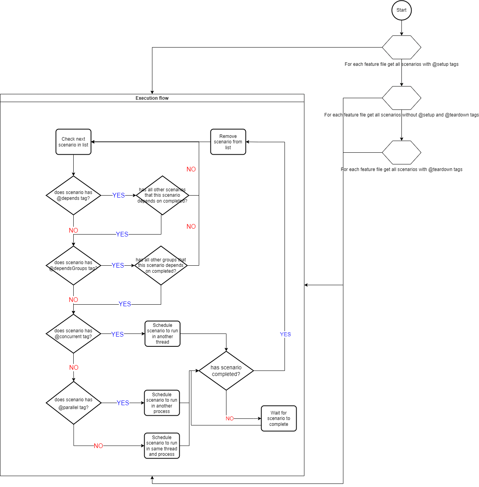
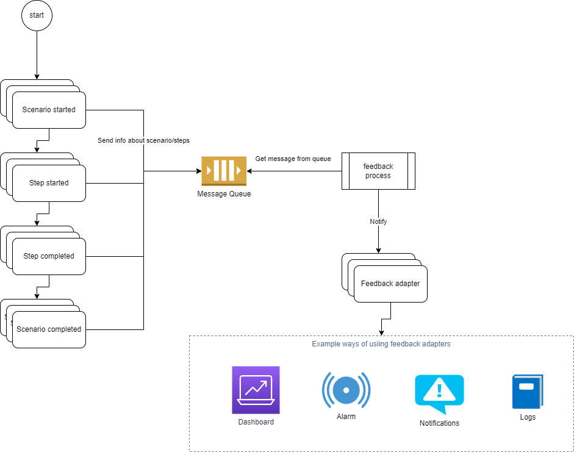

# Paraworld

*`This is the documentation for Version 1.6.0`*

**Paraworld** is a BDD framework using the Gherkin language for writing automated tests. The framework is written in Python 3.9.
It is created to allow the ease of writing concurrent and parallel scenarios.

The framework supports the following distinct features:

- [Run scenarios concurrently](#concurrent-scenarios)
- [Run scenarios in parallel](#parallel-scenarios)
- [Run steps concurrently](#concurrent-steps)
- [Apply ordering and dependency for scenarios](#dependency)
- [Timeline visualization](#timeline-visualization)
- [Dependency visualization](#dependency-graph)
- [Report visualization](#report-visualization)

# Documentation

- [Install](#install)
- [Getting started](#getting-started)
    - [Create gherkin feature](#create-gherkin-feature)
    - [Run gherkin feature](#run-gherkin-feature)
    - [Create step definition](#step-definition)
    - [Include step definition module and run gherkin feature file](#include-step-definition-module-and-run-gherkin-feature-file)
    - [Implement functionality for step definition](#implement-functionality-for-step-definition)
- [Execution flow](#execution-flow)
- [Features](#features)
  - [Concurrent scenarios](#concurrent-scenarios)
  - [Parallel scenarios](#parallel-scenarios)
  - [Concurrent steps](#concurrent-steps)
  - [Dependency](#dependency)
  - [Groups](#groups)
  - [Setup and teardown](#setup-and-teardown)
  - [Before and After scenarios](#before-and-after-scenarios)
  - [Timeline visualization](#timeline-visualization)
  - [Dependency graph](#dependency-graph)
  - [Report visualization](#report-visualization)
  - [JUnit report](#junit-report)
  - [Feedback system](#feedback-system)
    - [Feedback adapters](#feedback-adapters)
    - [Feedback schema](#feedback-schema)
- [Reference](#reference)
    - [API](#api)
    - [Tags](#tags)


# Install

To use the framework install it through pip:

```shell
pip install paraworld
```

# Getting started

Once you have installed **paraworld** you are ready to start writing your first BDD feature.
In order to get you started we will start by writing a simple feature with scenarios and implement the
functionalities.

## Create gherkin feature

Let's start by creating a feature to test out the performance of calling a specific API. Lets create a new file and call it *api.feature*.
Paste the below text into the *api.feature* file:

```feature
# api.feature

Feature: API performance test

    This feature will test the performance of calling an API

    Scenario: Call API successfully
        When call API endpoint https://httpbin.org/delay/2
        Then response status code should be 200
```

So the above feature file have a single scenario which is testing that calling the specified API endpoint will return a status code 200.

So now that we have written the feature in gherkin language, we are ready to run the feature file using **paraworld**.

## Run gherkin feature

Create a new python file called *api_test.py* and paste the below code into it:

```python
# api_test.py
1   import os
2   from conclave.task_runner import TaskRunner
3  
4   if __name__ == '__main__':
5       tr = TaskRunner(debugMode=True)
6       testResult = tr.run(["api.feature"])
7
8       print("\nprogram elapsed time :", testResult.elapsed)
9    
10      if not testResult.success:
11          print(f"Test failed")
12          os._exit(1)
```

Lets go through the above code. We are importing a few modules from line 1-2 and the important thing to notice above is the modules starting with **conclave** are the actual modules from **paraworld**.

Next we implements the *main* method in line 4 for this file and in the main method we instantiates an instance of class [TaskRunner](api.md#class-taskrunner) in line 5. To start the execution of the feature file we will need to call the [run method](api.md#runfeaturefiles) of the taskrunner instance passing in the name and path of the feature file we wish to execute. As you can see we can pass in multiple feature files to be executed, but in our case we only have a single feature we wish to execute.

Once the execution of the feature file has been completed we will get back a [TestResultInfo](api.md#testresultinfo) object which stores information with regards to the execution of the feature file.
In line 8 we are printing out the time it elapsed time of the entire execution. Then in line 10 we check if the execution has completed successfully and if it has not then we will exit the application with exit code 1.

Lets execute the above python file:

```shell
python api_test.py
```

You will see output similar to something like the below:



Lets examine the console output above. The text lines in cyan color are debug level messages. If we don't want to see the debug messages we should set the [debugMode parameter](api.md#class-taskrunner) to false. In our case it has been set to True in line 11 in the api_test.py code.

Following the debug messages we then have lines printed out in white color like the following:

```shell
[01/06/2022, 15:39:14 Call API successfully] Run scenario: Call API successfully
[01/06/2022, 15:39:14 Call API successfully] process pid: 215
[01/06/2022, 15:39:14 Call API successfully] thread id: 139688932083456
[01/06/2022, 15:39:14 Call API successfully] execute step: When  call API endpoint https://httpbin.org/delay/2
```

In the above we have information with regards to the scenario that is being executed, which is the scenario with the title *Call API successfully*. We can see that the scenario is being executed inside the process with PID *215* and on the thread with id *139688932083456*. Then it starts executing the step named *When call API endpoint https://httpbin.org/delay/2*.

But what happens next is we get an error:

```shell
[01/06/2022, 15:39:14 Call API successfully] failed: Traceback (most recent call last):
  File "/mnt/d/work/test-env/lib/python3.9/site-packages/conclave/scenario.py", line 48, in run
    self.__runSteps()
  File "/mnt/d/work/test-env/lib/python3.9/site-packages/conclave/scenario.py", line 137, in __runSteps
    raise Exception(f"Could not find matching step definition for: {step['keyword']}{step['text']}")
Exception: Could not find matching step definition for: When call API endpoint https://httpbin.org/delay/2
```

The above error says *Could not find matching step definition for: When call API endpoint https://httpbin.org/delay/2*.
What this means is the **TaskRunner** could not find any implementation for the specified step. We need to implement a step definition which is the code to be executed when the TaskRunner executes the above step.

Lets move on to the few last lines of the console output:



So the above snippet shows the summary of the execution being printed out. We will get a summary of all the features that have been executed with information about the status of each scenario and steps as well as their elapsed time. We can see that we have failed to execute the scenario called *Call API successfully* due to the missing step definition for step *When call API endpoint https://httpbin.org/delay/2*. But what is interesting is our second step *Then response status code should be 200* has status of *skipped*.

What does the status *skipped* mean? Well if the TaskRunner fails to execute the previous step for whatever reason then there is no point in executing all the subsequent steps and that is why the step has been marked as *skipped*. Notice that we have not implemented step definitions for both steps, so even our second step will also complain with missing step definition if we only implement the first step.

So we can see that our test failed due to missing step definitions. Let's go ahead and implement the step definition for the missing steps.

## Step definition

A step definition is a function that matches a given step and will be executed by the TaskRunner. The TaskRunner will look through all step definitions to find the one that matches the text of the step and in turn execute that function.

In the following we will create a new python file to store our step definitions. Create a new folder named *steps* and in there create a new python file named *api_steps.py* and paste the below code:

```python
# steps/api_steps.py
1   from typing import Match
2   from conclave.step import Step
3   from conclave.task_logger import TaskLogger
4   from conclave.scenario_scope import ScenarioScope
5 
6   @Step(pattern="^call API endpoint (.+)$")
7   def callAPIendpointStep(logger: TaskLogger, world: World, match: Match[str], context: ScenarioScope):
8       pass
9
10  @Step(pattern="^response status code should be (.+)$")
11  def validateStatusCodeStep(logger: TaskLogger, world: World, match: Match[str], context: ScenarioScope):
12      pass
```

Let's go through the code and explain how we have defined the step definitions. In line 2-3 we have imported the **paraworld** modules needed to define step definitions. We have created two functions called *callAPIendpointStep* and *validateStatusCodeStep* in line 7 and 11. These functions will do nothing as of now.

In order to mark a function as a step definition we will be using a python decorator class [Step](api.md#class-step). Line 5 and 9 we have added the **@Step** decorator to mark our two functions as step definitions. The **Step** decorator also takes a single parameter named *pattern* where the value is a regular expression that will be used by the TaskRunner to match against the text steps.

As you can see the two functions both have the same number of arguments:

- **logger** - an instance of class [TaskLogger](api.md#class-tasklogger). This object can be used to log information and will be shown in the console.
- **world** - an instance of class [World](api.md#class-world). The **World** class is an immutable key/value store that can be shared across features, scenarios and steps. It encompasses all shared variables across the entire application. We will show its usage later on.
- **match** - an instance of class [Match](https://docs.python.org/3/library/re.html#match-objects). This object holds the result of the matched regular expression and can for example be used to extract capturing groups from the regular expression. We will show its usage later on.
- **context** - an instance of class [ScenarioScope](api.md#class-scenarioscope). This objects can be used to store and retrieve custom data available throughout the current scenario only.

So now that we have implemented the step definition let's make sure our test knows about the definition and re-run the feature file.

## Include step definition module and run gherkin feature file

Lets open our *api_test.py* file and modify the code to import our module *api_steps.py*

```python
# api_test.py

1   import os
2   from conclave.task_runner import TaskRunner
3   from steps import api_steps
4  
5   if __name__ == '__main__':
6       tr = TaskRunner(debugMode=True)
7       testResult = tr.run(["api.feature"])
8
9       print("\nprogram elapsed time :", testResult.elapsed)
10    
11      if not testResult.success:
12          print(f"Test failed")
13          os._exit(1)
```

Then let's run the test again by executing:

```shell
python api_test.py
```

The console output should now look like:


We can see from the output that the TaskRunner can now find and match our two steps and they have been executed successfully.

## Implement functionality for step definition

The code for the step definitions are not that interesting since they do nothing, so let's go ahead and implement some real functionality for the two step definitions. Open the *steps/api_steps.py* file and modify it to look like the below:

```python
# steps/api_steps.py
1   from typing import Match
2   from conclave.step import Step
3   from conclave.world import World
4   from conclave.task_logger import TaskLogger
5   from conclave.scenario_scope import ScenarioScope
6   import requests

7   @Step(pattern="^call API endpoint (.+)$")
8   def callAPIendpointStep(logger: TaskLogger, world: World, match: Match[str], context: ScenarioScope):
9       url = match.group(1)
10      logger.log(f"Call API: {url}")
11      resp = requests.get(url)
12      logger.log(f"response: {resp}")
13      world.setProp("ApiStatusCode", resp.status_code)

14  @Step(pattern="^response status code should be (.+)$")
15  def validateStatusCodeStep(logger: TaskLogger, world: World, match: Match[str], context: ScenarioScope):
16      expectedStatusCode = match.group(1)
17      statusCode = world.getProp("ApiStatusCode")
18      if int(expectedStatusCode) != statusCode:
19          raise Exception(f"Expected status code {expectedStatusCode} but got {statusCode}")
20      logger.log(f"expected status code: {statusCode} SUCCESS")
```

Let's go through the code above and explain it. Line 8 we are extracting the url from the regular expression capturing group at index 1. This will give us whatever url the step text has supplied. Line 10 we have used the logger object to print the url to the console. Line 11 is the actual call to the url using HTTP GET. Line 12 we print out the response from the HTTP GET request. And line 13 we are using the world object to store the value of the status code under the key *ApiStatusCode*

Moving on to the next step definition we have line 16 which will be extracting the expected status code value from the regular expression capturing group at index 1. Line 17 we use the world object to retrieve the real status code value we have stored from the step definition in line 13. Line 18 we compare if the real status code matches the expected status code and if not we will raise an exception. Line 20 we print out that it all matches successfully.

Let us run the test again and see what we get now:

```shell
python api_test.py
```
The output should show something like the below:



We can see from the output that all steps have been executed successfully and the expected status code is 200 after calling the API endpoint.

# Execution flow

This part of the section will describe how **paraworld** run gherkin feature files and their scenarios. Understanding the execution flow will help you write gherkin scenarios in a much more efficient way and also avoids mistakes and troubleshooting time.

The below diagram illustrates the execution flow.



The following pseudo code describes how the execution flow looks like:

```
# collect all scenarios

for each feature file
  get all scenarios

# run all scenarios with @setup tags first

for each scenario marked with @setup tag
  does scenario have any @depends or @dependsGroups tag?
    if yes:
      check if any dependent scenario or group of scenarios have completed and if they have all completed then start this scenario.
      Otherwise put this scenario on pending list.
  does scenario have the @parallel or @concurrent tags?
    if yes then start the scenario immediately in another thread or another process
  If scenario is not on pending list start it immediately

# run all scenarios not marked as @setup or @teardown

for each scenario not marked with @setup or @teardown 
  does scenario have any @depends or @dependsGroups tag?
    if yes:
      check if any dependent scenario or group of scenarios have completed and if they have all completed then start this scenario.
      Otherwise put this scenario on pending list.
  does scenario have the @parallel or @concurrent tags?
    if yes then start the scenario immediately in another thread or another process
  If scenario is not on pending list start it immediately

# run all scenarios with @teardown tags

for each scenario marked with @teardown tag
  does scenario have any @depends or @dependsGroups tag?
    if yes:
      check if any dependent scenario or group of scenarios have completed and if they have all completed then start this scenario.
      Otherwise put this scenario on pending list.
  does scenario have the @parallel or @concurrent tags?
    if yes then start the scenario immediately in another thread or another process
  If scenario is not on pending list start it immediately

```

# Features

**paraworld** adds additional functionality to the gherkin feature by allowing you to execute scenarios and steps concurrently, in parallel and/or with ordering and dependency. This allows you to write flexible scenarios that can be optimized for performance as well as ensure scenarios runs a specific order.

Below are the highlighted features that **paraworld** offers:

- **Concurrent scenarios**. You can easily write gherkin scenarios that will be run concurrently by adding a tag to your scenario, see [@concurrent](tags.md#concurrent).
- **Parallel scenarios**. To allow gherkin scenarios to run in parallel you can add the tag [@parallel](tags.md#parallel)
- **Concurrent steps**. You can have gherkin steps run concurrently by using the step keyword [(background)](steps.md#background) in front of *Given, when, then, and* or use the keyword [Concurrently](steps.md#concurrently) instead.
- **Groups**. Gherkin scenarios can be grouped together by using the tag [@group](tags.md#group). This is useful for dependent execution where you want some scenarios to only execute after all scenarios in a given group has completed.
- **dependency**. You can have scenarios depends on each other by using the tags [@depends](tags.md#depends) or [@dependsGroups](tags.md#dependsgroups) to make sure that scenarios will not be executed before the dependant scenarios or group of scenarios have been completed.
- **Setup and teardown**. You can have scenarios that should always be executed before all other scenarios by adding the [@setup](tags.md#setup) tag. You can also have scenarios that must be run after all scenarios has completed by adding the [@teardown](tags.md#teardown) tag.
- **Before and After scenario**. You can define methods that should always be executed before the start of each scenario and also after a scenario completes. This can be achieved using the [@BeforeScennario()](api.md#class-beforescenario) and [@AfterScenario()](api.md#class-afterscenario) decorators.

## Concurrent scenarios

Before we dive into the details for setting up concurrent scenarios, let's briefly explain what concurrency is with regards to **paraworld**. So in python we know that there exists such a thing called a [GIL](https://wiki.python.org/moin/GlobalInterpreterLock) which is roughly a mutex lock around the python interpreter only allowing a single thread to execute at a time. This design is to avoid nasty deadlocks and memory leaks from multi-threaded programs. But what this also means is you will not be able to take advantage of multiple CPU cores for executing multiple threads at the same time. This can be a bottleneck for CPU bound tasks but not such a big problem for I/O bound tasks.

**paraworld** allows you to run scenarios in a multi-threaded environment by creating and managing threads to execute scenarios, and that is what we call *concurrent scenarios*. It is ideal for speeding up things that are waiting for I/O requests, such as disk, file, network etc.
In order to mark a scenario as concurrent, you will have to add a gherkin tag named [@concurrent](tags.md#concurrent) to your scenario.

Example:

```feature
Feature: concurrent scenario test
  
  @concurrent
  Scenario login to web portal with bob
    
    run this scenario in another thread

    Given a user bob
    Then login to web portal
  
  @concurrent
  Scenario login to web portal with jil

    run this scenario in another thread

    Given a user jil
    Then login to web portal
  
  Scenario login to database
    
    this scenario will run in the same thread as the main application thread

    Given a master user
    Then login to database
  
  Scenario query database
    
    this scenario will also run in the same thread as the main application thread, but will
    not start before the previous scenario has completed

    Given connection to database
    Then query database
```

From the example above we have four different scenarios and we have marked the first two scenario to run concurrently, whereas the last two scenarios will run in the same thread as the main application. What will happen is that the scenarios marked with the **@concurrent** tag will be scheduled to run in another thread and will start execution immediately. The third scenario will also be started but will run on the main thread and the last scenario will wait for the third scenario to finish before it can be scheduled to run on the main thread.

All the steps in a concurrent scenario will run in the same thread as the scenario unless the steps themselves are marked as concurrent steps using either keywords [(background)](steps.md#background) or [Concurrently](steps.md#concurrently), in which the steps themselves will also be scheduled to run in another thread.

## Parallel scenarios

**paraworld** also offers a way to run scenarios in parallel. Running a scenario in parallel is different from running a scenario concurrently, see section [Concurrent scenarios](#concurrent-scenarios) for an explanation of concurrent scenarios. Because python interpreter has a [GIL](https://wiki.python.org/moin/GlobalInterpreterLock) which only allows a single thread to executed at a time, any CPU bound tasks suffers from this architecture. In order to circumvent this limitation we can run multiple python process instead of running multi-threaded.

**paraworld** allows you to mark gherkin scenarios to be run in parallel and what that means is the scenario will be executed in another python process other than the main process. To facilitate this **paraworld** will manage the creation of additional process and schedule scenarios to be executed in those processes. In order to use this feature you will have to tag your scenario with the tag [@parallel](tags.md#parallel).

Example:

```feature
Feature: parallel scenario test
  
  @parallel
  Scenario login to web portal with bob
    
    run this scenario in another process

    Given a user bob
    Then login to web portal
  
  @parallel
  Scenario login to web portal with jil

    run this scenario in another process

    Given a user jil
    Then login to web portal
  
  Scenario login to database
    
    this scenario will run in the same process as the main application process

    Given a master user
    Then login to database
  
  Scenario query database
    
    this scenario will also run in the same process as the main application process, but will
    not start before the previous scenario has completed

    Given connection to database
    Then query database
```

From the example above we have four different scenarios and we have marked the first two scenario to run in parallel, whereas the last two scenarios will run in the same process as the main application. What will happen is that the scenarios marked with the **@parallel** tag will be scheduled to run in another process and will start execution immediately. The third scenario will also be started but will run on the main process and the last scenario will wait for the third scenario to finish before it can be scheduled to run on the main process.

Data are local to each process, unless you store them in the [World](api.md#class-world) object, in which they will be synchronized and available to other processes.

## Concurrent steps

**paraworld** allows you to run each gherkin step in a separate thread, thus you could have both multi-threaded scenarios that in themselves contain multi-threaded steps. To make steps run concurrently **paraworld** has extended the gherkin language to support a few additional keywords that can be used in front of steps. These are:

- [(background) Given](steps.md#background)
- [(background) When](steps.md#background)
- [(background) Then](steps.md#background)
- [(background) And](steps.md#background)
- [Concurrently](steps.md#concurrently)

Any steps that contains those keyword at the beginning of the text will be scheduled to run concurrently in a separate thread.

Example:

```feature
Feature: concurrent steps test
  
  @parallel
  Scenario set uncle relationship
    
    Run this scenario in another process.
    Creation of the users are done concurrently.

    (background) Given a user bob
    (background) Given a user jil
    Then set bob as uncle of jil
  
  @concurrent
  Scenario set brother relationship

    Run this scenario in another thread.
    Creation of the users are done concurrently.

    (background) Given a user jack
    (background) Given a user john
    Then set john as brother of jack
  
  Scenario set sister relationship
    
    this scenario will run in the same process as the main application process and in the same thread as the main thread.
    Creation of the users are done concurrently.

    Concurrently a user mary
    (background) Given a user hans
    Then set mary as sister of hans
```

The example above shows how we can have concurrent steps in different scenarios. The first scenario is being run in parallel and the first two steps in that scenario is run concurrently in a separate thread in that process.

The second scenario is being marked to run concurrently in a separate thread than the main thread but in the same process as the main process. We again have the first two steps of that scenario bein scheduled to run concurrently in a separate thread in that process.

And the last scenario we are running the scenario in the same thread and process as the main thread and process. The first two steps are scheduled to be run concurrently in a separate thread.

So you can see that *concurrent steps* are just a more granular way to allow functionality to be executed multi-threaded regardless of how the scenarios are being scheduled.

## Dependency

**paraworld** allows you to manage dependencies between gherkin scenarios using the tags [@id](tags.md#id) and [@depends](tags.md#depends). What this means is you can have scenarios waiting for other scenarios to complete before they can start executing. Each scenario have an implicit unique identifier associated, but by using the [@id](tags.md#id) tag you can explicitly specify your own id for the scenario. In order for a scenario to depend on another scenario, you will need to know the unique identifier of the scenario you depends on. Using the tag [@depends](tags.md#depends) you will specify the id of the scenario to depend on. A scenario can depend on multiple scenarios by adding multiple [@depends](tags.md#depends) tags to the scenario.

Let's illustrate this with an example.

Example:

```feature
Feature: testing of dependency

  @id_A
  Scenario: scenario 1 has unique id of A
    Then step 1
  
  @depends_A
  @id_B
  Scenario: scenario 2 has id B and depends on scenario with id A
    Then step 2

  Scenario: scenario 3 has an implicit unique id
    Then step 3

  @depends_A
  @depends_B
  Scenario: scenario 4 depends on both scenario 1 and 2
    Then step 4
```

Let's walk through the above example.

1. The first scenario has the id tag applied and the id is A. It will start execution first
2. Scenario 2 has id of B but depends on scenario with id of A, which is scenario 1.
3. Scenario 3 is not depending on any specific scenarios and also does not have any explicit id
4. Scenario 4 depends on scenarios with id A and B, which are scenario 1 and 2.

By using dependency tags, you do not need to write the scenarios in a specific order, but can have scenarios written in any order but explicitly control the execution flow of the scenarios.
## Groups

Groups are a way to organize the gherkin scenarios into logical categories. The main purpose of having groups is to allow ordered execution and dependency management for gherkin scenarios. It allows you to write tests where scenarios can depend on other scenarios. For example a scenario can be depending on all scenarios that belongs to a certain group to complete their execution before it can be started. By introducing groups you don't need to add dependency for each individual scenarios, but instead can depend on a group.

The way to use groups is to use the [@group](tags.md#group) and [@dependsGroups](tags.md#dependsgroups) tags in your scenarios. Let's illustrate this with an example:

Example 1:

```feature
Feature: testing of groups

  @group_A
  Scenario: scenario 1 belongs to group A
    Then step 1
  
  @group_B
  Scenario: scenario 2 belongs to group B
    Then step 2

  @dependsGroups_A
  Scenario: scenario 3 depends on group A
    Then step 3

  @group_A
  Scenario: scenario 4 belongs to group A
    Then step 4
```

Let's walk through the example above. As we can see we have 4 scenarios, where the first and last scenario belongs to group A, and the second scenario belongs to group B. The third scenario does not belong to any group but is depending on group A.

The execution order is as follows:

1. Scenario 1 starts execution
2. Scenario 2 waits for scenario 1 to finish then starts execution
3. Scenario 3 waits for scenario 2 to finish and then checks that it is depending on group A, but since group A contains scenario 1 and scenario 4, and only scenario 1 has finished execution, then scenario 3 is skipped for now.
4. Scenario 4 starts execution
5. Once scenario 4 is completed then scenario 3 will start execution, because now all scenarios in group A has completed.

A scenario can only be part of a single group, but a scenario can depend on multiple groups.

Example 2:

```feature
Feature: testing of multi groups dependency

  @group_A
  Scenario: scenario 1 belongs to group A
    Then step 1

  @dependsGroups_A
  @dependsGroups_B
  Scenario: scenario 2 depends on group A
    Then step 2

  @group_B
  Scenario: scenario 3 belongs to group B
    Then step 3

  @group_A
  Scenario: scenario 4 belongs to group A
    Then step 4
```

So in the above example scenario 2 now depends on both group A and B. What this means is that no matter what, scenario 2 will always run last, beause it has to wait for all the other scenarios to complete.

## Setup and teardown

**paraworld** supports what are called *setup* and *teardown*. What this means is you can have scenarios that should always run before all other scenarios by using the tag [@setup](tags.md#setup). This can be useful when you have some prerequisites scenarios that needs to be performed before other scenarios can start. And you can also have scenarios that must always run after all other scenarios have completed regardless of whether those scenarios failed or completed successfully. To do this you should mark the scenarios with the [@teardown](tags.md#teardown) tag.

Example:

```feature
Feature: testing of setup and teardown

  Scenario: scenario 1
    Then step 1

  @setup
  Scenario: scenario 2 will always run before all other scenarios
    Then step 2

  @teardown
  Scenario: scenario 3 will run last after all other scenarios have completed
    Then step 3

  Scenario: scenario 4
    Then step 4
```

Let's break down the example above. 

1. Scenario 2 is marked with the @setup tag and as such will be scheduled to run first
2. Scenario 1 will then be started
3. Scenario 4 will execute after scenario 2
4. Scenario 3 will execute last since it has been marked with the tag @teardown

So setup and teardown features are useful if you need to ensure proper setup of all your scenarios and cleanup afterwards.

## Before and After scenarios

You can define methods that should be executed before each scenario starts and after each scenario ends.

To do that you will need to decorate your custom methods with the [@BeforeScennario()](api.md#class-beforescenario) or [@AfterScennario()](api.md#class-afterscenario) decorator.

Your custom methods must also have the following parameters:

*Example before scenarios*:

```python
from conclave.before_scenario import BeforeScenario
from conclave.scenario_scope import ScenarioScope

@BeforeScenario()
def before_scenario(logger: TaskLogger, world: World, context: ScenarioScope):
    logger.log(f"Before scenario")
```

*Example after scenarios*:

```python
from conclave.after_scenario import AfterScenario
from conclave.scenario_scope import ScenarioScope

@AfterScenario()
def after_scenario(logger: TaskLogger, world: World, context: ScenarioScope):
    logger.log(f"after scenario")
```

You can have multiple before scenario methods and after scenario methods. Each before scenario methods will be run in the order found and the same with each after scenario methods.

If an exception occurs in any of the before scenario methods all the steps will be skipped.

## Timeline visualization

Take a look [here](timeline-visualization.md#timeline-visualization) to learn more about the timeline visualization.

## Dependency graph

Take a look [here](dependency-graph.md#dependency-graph) to learn more about the dependency graph.

## Report visualization

Take a look [here](report-visualization.md#report-visualization) to learn more about the report visualization.

## JUnit report

**paraworld** supports generating JUnit XML report. To do this call the [generateJUnitReport()](api.md/#generatejunitreport) of the TaskRunner.

Example:

```python
tr = TaskRunner()
tr.run(["some.feature"])
tr.generateJUnitReport()
```

## Feedback system

**paraworld** enables you to get immediate feedback whenever scenarios and steps have started and completed. This allow you to get near-realtime notifications during the execution flow.

The below diagram shows the feedback architecture:



Every time a scenario or step has been started or completed a message will be sent to a message queue with details about the scenario or step. The message will be put into queue without waiting for any response so it is a fire and forget action, in order to not impact performance of the execution flow.

Another process called the **feedback process** will continously fetch messages from the shared message queue and notify all [Feedback adapters](#feedback-adapters) about the changes.

### Feedback adapters

A feedback adapter is just a recipient of the message and what to do with the received message is entirely up to the implementation of the feedback adapter. For example it can be implemented to store the messages in a log system or notify an alarm if a scenario or step fails and so on.

To implement a feedback adapter you must create a python class derived from the base class [FeedbackAdapter](api.md#class-feedbackadapter). The following code snippet is an example implementation of a feedback adapter.

```python
from conclave.feedback_adapter import FeedbackAdapter
from conclave.feedback_schema import ScenarioFeedback, StepFeedback

class NullFeedbackAdapter(FeedbackAdapter):

    def __init__(self):
        pass

    def onNotifyScenario(self,schema: ScenarioFeedback):
        print(f"scenario: {schema}")
    
    def onNotifyStep(self,schema: StepFeedback):
        print(f"step: {schema}")
```

The two methods [onNotifyScenario](api.md#onnotifyscenarioschema) and [onNotifyStep](api.md#onnotifystepschema) must be implemented and this is where you add your business logic to handle whenever a scenario or step message is received. The actual message is passed as parameter to the two methods and can be used to get info about the scenario or message received.

Once you have implemented the feedback adapter you must register the adapter with the TaskRunner using the method [registerFeedbackAdapter](api.md#registerfeedbackadapter) of the TaskRunner.

```python
tr = TaskRunner()
tr.registerFeedbackAdapter(NullFeedbackAdapter())
```

Each registered feedback adapter will be notified in the order they are registered.

### Feedback schema

A feedback schema is the data format that are being sent by the feedback system to the message queue and passed to any feedback adapters registered. To see a full description of the schema types take a look [here](feedback-schema.md#feedback-schema).

# Reference

## API

[Here](api.md#api-reference) is a complete reference of all the classes and methods available in **paraworld**.

## Tags

[Here](docs/tags.md#tag-reference) is a complete refereance of all the available tags in **paraworld**
