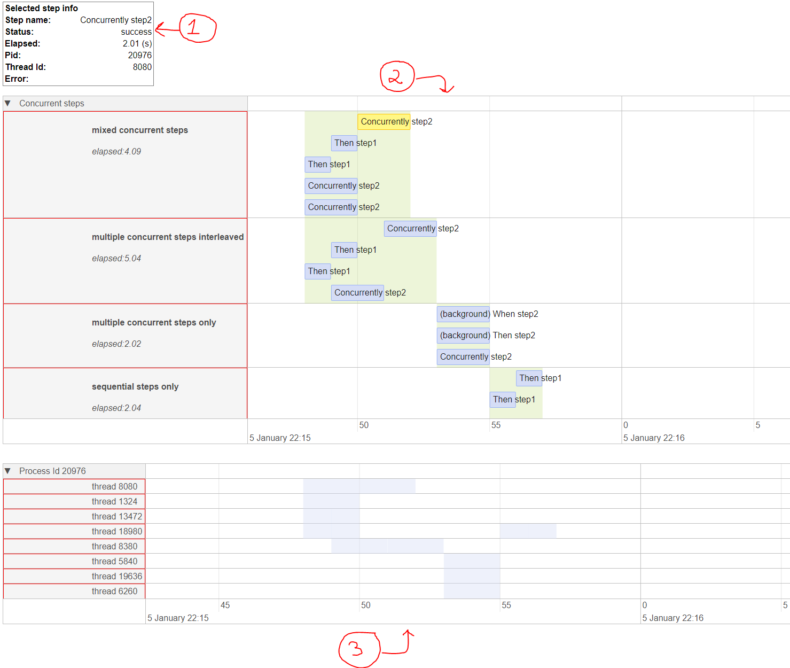

# Timeline visualization

*`This is the documentation for Version 1.6.0`*

**paraworld** can visualize the flow of execution as a timeline graph. This is helpful in understanding how long each scenario takes to execute and when they are being executed in time as well as understanding the concurrency and parallelization part of the execution flow.

To generate the timeline graph you will need to call the method [generateTimeline()](api.md#generatetimeline) of the [TaskRunner](api.md#class-taskrunner) object.

Example:

```python
tr = TaskRunner(debugMode=True)
tr.run(["test.feature"])

tr.generateTimeline()
```

The output will be an HTML file named *timeline_output.html* which will look something like this:



Lets break down the main parts of the UI above:

1) this box displays the selected step and shows various information about the step such as:

    - Step name - the step text as written in gherkin
    - Status - did step completed successfully or failed or skipped
    - Elapsed - the time in seconds it took to execute the step
    - Pid - the identifier of the process that the step was executed on
    - Thread id - the identifier of the thread that the step was executed on
    - Error - any error message produced by executing the step

2) This is the main timeline graph which shows all the scenarios on the left side and on the right side are all the steps belonging to their respective scenario. The green background is there to help visualize the duration of the scenario and is the time it takes to execute all steps in the scenario.

    Each step in the scenario is represented as a blue rectangle of varying size which depends on the duration it took to execute the step. The step text is overlayed on top of the blue rectangle.

    The x-axis of the graph shows the date time.

    You can click on any step and it will be highlighed and the detailed information for the step will be shown in the box above the timeline graph. You can also hover above each step and a tooltip will be shown with partial information about the step.

3) This part of the UI shows all process and the thread identifiers that are being used during the execution.